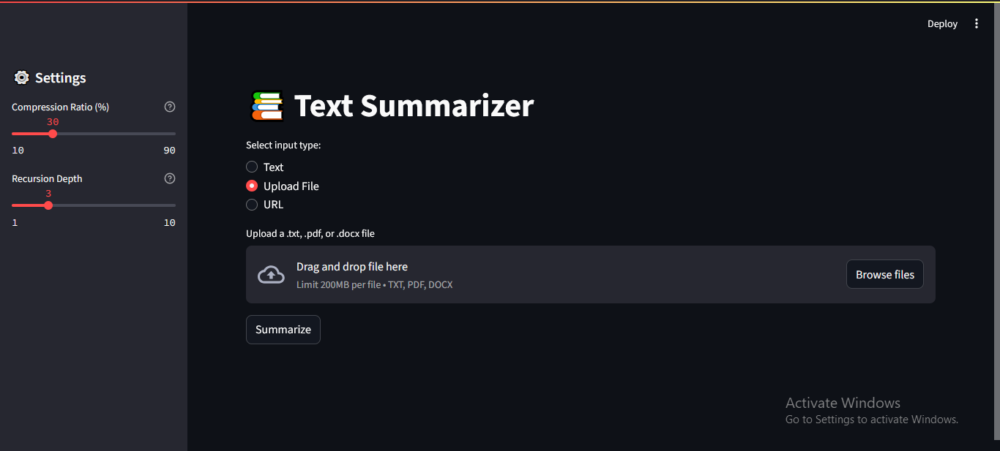

# 📚 Text Summarizer Chatbot

This is a Streamlit-based NLP web app that summarizes long-form text from **raw input**, **files**, or **URLs** using the pre-trained [`facebook/bart-large-cnn`](https://huggingface.co/facebook/bart-large-cnn) model from Hugging Face Transformers.

---

## 🚀 Features

- ✍️ Summarize plain text typed or pasted in the text box
- 📂 Upload `.pdf`, `.docx`, or `.txt` files for summarization
- 🌐 Enter a URL to extract and summarize article content
- 🎛️ Adjustable **compression ratio** and **recursion depth**
- 🧠 Powered by Hugging Face Transformers (`facebook/bart-large-cnn`)
- ✅ Clean, user-friendly Streamlit interface

---

## 🖼️ Demo Screenshot



---

## 📦 Installation

```bash
git clone https://github.com/your-username/text-summarizer-app.git
cd text-summarizer-app
pip install -r requirements.txt
